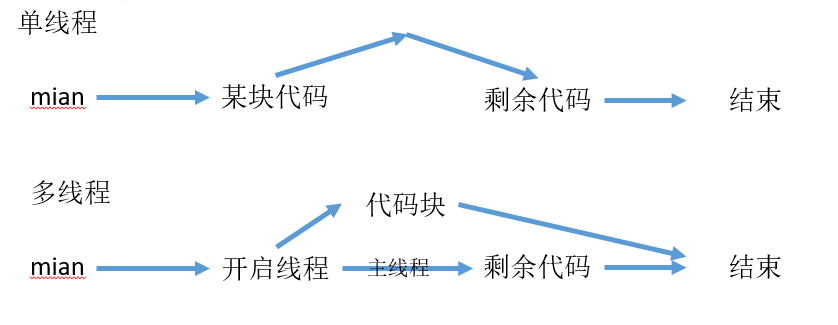

<h1>多线程</h1>

进程是操作系统分配资源的单位，一个进程至少包含一个线程



线程什么时候执行是由CPU决定的

每个线程都有自己的工作空间（从主存中拷贝数据到工作空间），工作空间与主存交互

---

<center>Contents</center>

[TOC]

---

### 1. 创建线程：推荐实现Runnable接口

* 直接继承Thread类，重写run方法

  创建对象并调用start方法开启线程

  ```java
  run 方法没有返回值而且不能对外声明异常
  public void run()
  ```

  

* 实现Runnable接口，重新run方法

  使用Thread类代理，调用start方法

  ```shell
  #使用该方法的好处
  避免java单继承的局限性；
  可以使用多个Thread代理同一个对象，实现线程间的资源共享;
  
  Ticktets ticktets = new Ticktets();
  new Thread(ticktets,"Abi").start();
  new Thread(ticktets,"ACi").start();
  new Thread(ticktets,"BLei").start();
  ```

* 实现Callable接口（juc并发）,重写callable方法

  ```java
  public Object callable() throws Excpetion；
  ```

  ```java
  使用方法：
  需要借助服务和线程池
  ExecutorService service = Executors.newFixedThreadPool(3);//创建线程池，开启服务
  Future<Boolean> pic1 = service.submit(Callable的实例);//提交执行
  pic1.get();//获取执行结果
  service.shutDownNow();//关闭服务
  ```

### 2.静态代理

静态代理：类已经写好了，可以直接用 如Thread类

动态代理：运行过程中临时构建的类

```java
真实角色、代理角色 都要实现同一个接口
代理角色 声明 接口类型的成员属性 （new Thread(RannableInstace)）

--------------------------------------------------------
// 接口
interface Marry{ void happyMarry();}
//真实角色
class You implements Marry{
    @Override
    public void happyMarry() {System.out.println("xxxxx");}
}
//代理角色
class WeddingCompany implements  Marry{
    //代理对象：真实角色
    private Marry target;
    public WeddingCompany(Marry target) {this.target = target; }
    @Override
    public void happyMarry() {
        ready();
        this.target.happyMarry();
        affter();
    }
    private void affter() {System.out.println("收工");}
    private void ready() {System.out.println("开始准备");}
    
//使用静态代理
new 代理对象(new 真实对象).接口方法()
new WeddingCompany(new You()).happyMarry();
```

### 3. Lambda表达式简化简单线程

<font color="red">接口中只有一个方法、只使用一次</font>

```java
new Thread(()-> {
            for (int i =0;i<5;i++){
                System.out.println("Lambda线程");
            }
        }).start();

//函数式编程
(形参...)->一行语句；
(形参...)->表达式;//reurn 结果的表达式
(形参...)->{代码块}；
```

```shell
外部类 -> 静态内部类 -> 局部内部类 -> 匿名内部类 -> lambada
```

```java
lambda示例
//接口 方法带返回类型和参数
interface Lambda{int lambda(int a,int b);}
// Lambda写法 ：只有一行代码时 如return a+b
int sum = ( (Lambda) (a,b)->a+b ).lambda(1,2);
//或者
Lambda l = (a,b)->a+b;
int sum = l.lambda(1,2);
//------------------------
//当接口中有多行代码
Lambda l = (a,b)->{sout("xxx");
		return a+b;};
//当接口方法参数只有一个时可以省略括号
//当接口方法参数类型可以推导出时可以不写参数类型
```

### 4.线程状态

>th.getState()返回线程状态  Thread.State.xxx
>
>Thread.activeCount();//活动线程数
>
>th.isAlive()
>
>Thread.currentThread();//获取当前线程


* 新生 ：new Thread()

* 就绪：start()

* 运行：由CPU处理无法人为干预

* 线程停止：操作标志位

  线程执行完 或者 外部干涉（加入标志位）

  不要使用stop()或者destory()

  ```java
  public class Dead implements Runnable{
      //加入标志位
      private boolean flag = true;
      @Override
      public void run() {
          while(flag){....;}}
      //干预标志位
      public void setFlag(boolean b){this.flag=b;}
  }
  ```

* 阻塞

  另一个打断阻塞的线程，阻塞的线程会抛出异常，非正常结束阻塞的线程都会抛出异常

  阻塞分类：普通阻塞，等待队列，锁池队列

  > 普通阻塞：sleep(100) 调用interrupt打断
  >
  > 等待队列：wait() 只能被notify打断
  >
  > 锁池队列：无法获取锁标记导致阻塞 ，只有reentrantLock调用 lock.lockInterruptibly()获取锁标记进入的阻塞才能被打断

  1. IO操作等待操作系统时进入阻塞；

  2. Thread.sleep(毫秒)：运行 -> 阻塞

     ```shell
     不释放锁；
     存在 InterruptedException
     时间结束进入就绪态，常用来模拟网络延时、定时、倒计时
     ```

  3. Thread.yield()：运行 -> 就绪

     ```java
     礼让线程，将当前线程由运行转为就绪，让CPU创新调度，是否礼让未知
     ```

  4. th.join()  可以指定时间为插队时长，指定时间内未执行完就重新调度

     ```java
     插队线程
     将某个线程th插队到当前线程，当前线程被阻塞
     插队线程执行完后，当前线程才能继续执行
     ```

  5. interrupt() 通知wait(),join(),sleep() 退出阻塞

     ```java
     th.interrupt();//并不是真的打断线程，而是通知阻塞中的线程退出阻塞
     th.isInterrupted();//检查标志位
     Thread.interrupted();//清空标志位
     ```

     

### 5.线程优先级 priority 仅代表被执行的概率，不是绝对的执行顺序

要在启动之前设置

```shell
数字优先级：1-10
常量优先级：
NORM_PRIORITY 5 默认
MIN_PRIORITY 1
MAX_PRIORITY 10
```

### 6. 守护线程

线程分为```默认的 用户线程``` 和 ```为用户线程服务的守护线程```

虚拟机不会等守护线程执行完毕，只有所有用户线程执行完就停止虚拟机

守护线程可用于监控日志等

```java
// 默认所有的线程都是用户线程，所有用户线程结束后虚拟机才会关闭
//将用户线程设置为守护线程
daemon.setDaemon(true);
```


### 7. 线程同步

```多个代理访问同一资源时导致线程不安全，（抢票问题可能出现负数或相同的数）```

```只有操作数据修改的情况下才需要控制线程安全；```

* **并发：同一个对象   被多个线程    同时操作** 

  > 导致数据不准确的问题--线程不安全

* **线程同步 ：保证线程安全**

  ##### 线程同步实现条件：形成等待池队列 + 对象锁

  > 队列：排队，根据算法决定哪个线程先使用资源

  > 对象的锁：标识该资源被占用，其他线程等待

  保证一个时间点只有一个线程访问该资源

  锁机制 synchronized，线程获得排他锁后独占资源，其他线程必须等待。

  使用锁的目的：保证操作的原子性

  **使用锁机制导致的问题：**

  * 一个线程持有锁会导致其他需要该锁的线程被挂起
  * 加锁、释放锁会导致较多上下文切换的调度延时
  * 高优先级线程等待低优先级线程释放锁导致优先级倒置，引起性能问题

* **synchronized 锁对象的资源**

  **静态方法是锁Class对象；**

  **成员方法锁方法资源对应的  this ，如果方法中有的资源不是该对象的则可能锁失败**

  **出现异常时自动释放锁 ** 需要在catch中保证操作的原子性

  <font color="red">锁的对象一定要准确</font>

  <font color="red">同步方法只防止其他线程再调用 该 同步方法，不影响其他线程调用非同步方法或其他同步方法</font>

  出现位置：保证数据准确的同时要效率高

  同步监视器：对象/this/xxx.Class  使用共享资源（要修改的对象）作为同步监视器

  * **方法：同步方法 :  方法太大会影响效率**；同步监视器是this或者xxx.class 不需要指定

    ```java
    public synchronized void test(){...}
    synchronized锁的该方法对应的对象，不是方法
    ```

  * **代码块：同步块：**需要指定同步监视器

    **<font color="red">在执行同步代码块之前最好判断一下是否有必要执行同步代码块，如果没有必要就不要等待</font>**

    ```java
    同步监视器（被锁对象）：对象/this/xxx.class
    synchronized (同步监视器){....}
    
    List<String> list = new ArrayList<>();
            synchronized (list){
                for (int i=0;i<100;i++){
                    new Thread(()->list.add(Thread.currentThread().getName())).start();}}
    
    
    使用双重检测，提高性能
    void take2(){
       // 检测一：没有票的情况直接过滤
        if (total<0){flag = false;return;}
        synchronized (this){
           //检测二：临界值 只剩一张票时
           if (total<0){flag = false;return;}
           sout(xxx);     
         }
      }
    ```

  java中的4种块

  ```
  方法块：局部块，声明变量，开始释放内存
  构造块：初始化对象
  静态块：初始化类，现于构造块执行
  同步块：解决线程安全问题
  ```


### 8. 死锁

过多的同步可能造成死锁；当一个同步块同时持有两个以上对象的锁时可能发生死锁。

多个线程各种占有一些共享资源，并且相互等待其他线程释放资源，导致多个线程相互等待停止执行；

**避免使用锁套锁**

### 9. 线程协作 

生产者消费者模式，大量的生产者消费者模式使用消息队列

```
生产者消费者模式：麦当劳先收钱然后等待

BIO模式：阻塞IO：肯德基 一对一服务 点单出货收钱
```

```
生产者：没有商品时通知消费者等待，有商品时通知消费者消费

消费者：消费之后通知生产者生产
```

synchronized可以阻止并发更新同一个共享资源，实现了同步，但是不能实现线程间通信

Object对象的 wait()、notify()、notifyAll()来解决线程通信问题（只能在同步方法、同步代码块使用，否则会有异常）

| 方法名                         | 作用                                                       |
| ------------------------------ | ---------------------------------------------------------- |
| final void wait()              | 线程等待进入阻塞，释放锁                                   |
| final void wairt(long timeout) | 等待指定毫秒                                               |
| final void notify()            | 唤醒第一个处于等待的线程，线程进入Runnable状态             |
| final void notifyAll()         | 唤醒同一个对象上所有调用wait的线程，优先级高的线程优先调度 |

* **生产者/消费者模式 1 ： 管程法**

  使用容器来实现；实现了解耦（生产者消费者不直接打交道）、提高效率（避免忙时太忙，闲时太闲）

  ```shell
  生产者、消费者：多线程
  容器：并发容器 添加和取出商品
  商品
  # 通过容器当前容量来判断进行等待和通知
  ```

  

  **生产者将生产的数据存入"缓冲区"；消费者从"缓冲区"取数据**

* **生产者/消费者模式 2：信号灯法**

  ```shell
  信号灯：使用标志位 来判断等待和通知
  ```

### 10.高级主题 volatile 保证线程间变量的可见性

* 任务定时调度

  通过Timer和TimerTask实现定时启动线程

  ```java
  java.util.Timer : 本身就是一个线程，闹钟功能
  java.util.TimerTask：抽象类，实现了Runnable接口 写具体内容
  ```

  ```java
  继承TimerTask重新run方法
  Timer timer = new Timer();
  timer.schedule(timerTask实例，延迟，重复时间)
  ```

* QUARTZ 框架实现复杂任务调度

  Schedule： 调度器，控制所有调度

  Trigger：触发事件，采用DSL模式（

  ```shell
  DSL：领域特定语言 ;流模式;（用简洁代码解决特定问题）
  调用方法： xx.M1().M2().M3()....
  流模式又称方法链
  ```

  JobDetail：需要处理的JOB

  Job：执行逻辑

* HappenBefore：指令重排，改变执行顺序，将下一条无关（与当前数据没有依赖）指令提前执行，导致代码执行顺序与预期不一致

  ```shell
  代码执行步骤：取指令 -> 解码,取值 -> 操作 -> 写回（操作慢，CPU可能不等）
  ```

  CPU指令重排、虚拟机指令重排

* volatile 保证线程间变量的可见性，避免指令重排；其他线程可以看到变量变动

  不能保证原子性：取指-解码-操作可能不会全部完成


### 11.使用DCL(double checking locked)和volatile 实现单列设计模式

对外只有一个对象

```java
 * 构造器私有化，
 * 内部提供私有静态属性存储对象地址
 *     属性没有new对象称为懒汉式、有对象称为饿汉式
 * 对外提供公共静态方法获取对象
```

* 使用DCL(double checking locked)和volatile 实现单列设计模式

```java
public class DanLi {
    //构造器私有化
    private DanLi(){ }
    //静态属性存贮对象, 直接有new 对象为饿汉式；为空时是懒汉式
    //使用volatile避免指令重排，避免其他线程拿到未初始化的对象
    private static volatile DanLi instance;
    //对外提供公共静态方法访问属性
    public static DanLi getInstance(){
        //如果存在实例，直接返回，避免不必要的等待
        if (null != instance)return instance;
        //静态资源，锁定Class
        synchronized (DanLi.class){
            // 开辟空间，初始化对象，返回对象地址；
            // 构造很耗时，可能导致指令重排,使得另一个线程拿到还没初始化完的对象
            if (instance == null)instance = new DanLi();
        }
        return instance;
    }
    public static void main(String[] args) {
        new Thread(()-> System.out.println(DanLi.getInstance())).start();
        new Thread(()-> System.out.println(DanLi.getInstance())).start();
    }
}
```

### 12. ThreadLocal

**结构类似于 Map，KEY是线程信息，VALUE是线程数据**

官方推荐 将ThreadLocal设置为 private static

```java
threadLocal.set()\get()\initalValue

ThreadLocal 中每个线程有自己的独立空间，不会影响到其他线程空间
```

**InheriableThreadLocal是ThreadLocal的子类 拷贝上级线程(调用start方法的线程)的数据**


### 13.可重入锁

使用的锁是系统提供的内置锁是可重入锁

**线程 试图获取自己已经持有的锁时会立即成功**，并将该锁的计算值+1，当线程退出同步代码块时计数值-1 ，当计数值=0时锁释放，如果没有可重入锁的支持，线程自己等待自己会导致死锁；

子类覆盖父类的同步方法，在调用父类同步方法时也可重入

JUC提供了可重入锁：ReentranLock

### 14 . 悲观锁与乐观锁

悲观锁：synchronized是独占锁，悲观锁，会导致其他需要锁的线程挂起

乐观锁：不加锁，更新数据时需要维护 具体数值和对应的版本，提交修改时只更新最新版本，如果落后就重新操作

CAS：Compare And Swap  比较&交换  是硬件级别操作，效率比锁高

* CAS是乐观锁的一种实现：当前值V、原来值A、最新值 B
* AtomicInteger是已经实现好的CAS类


### 15. 线程组 ThreadGroup

所有线程默认在系统线程组，线程组内，线程可以相互访问，比如调用join方法

```java
ThreadGroup tg = new ThreadGroup();
new Thread(tg,runnable);
```


