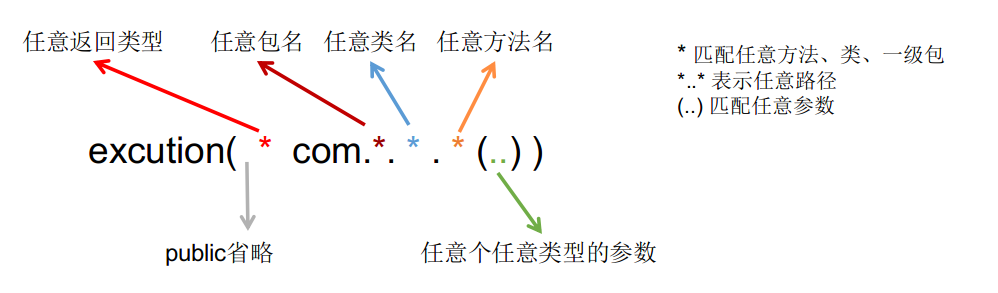

<h1>Spring</h1>
spring核心功能：IOC/DI、AOP、声明式事务

IOC：解耦；AOP：扩展

core container：core、beans、expression、context

---

[TOC]

---

#### 1. IOC：控制反转

​	完成原来由程序员主动实例化对象的事情

​	控制：控制类的对象，反转：交由Spring管理

​	**解耦：解除了对象管理和程序员之间的耦合**

* 核心包：core、beans、expression、context、commons-logging

* 配置文件：applicationContext.xml  配置内容最终存储到Spring容器```ApplicationContext```

  配置文件基于schema(.xsd文件)，可以理解为DTD(xml语法检测)的升级版，比DTD具有更好的扩展性

  ```xml
  <bean id="people" class="com.ioc.Entity.People">
      <property name="name" value="Abi"/>
      <property name="age" value="20"/>
  </bean>
  ```

* 默认配置文件加载时就创建对象

  ```java
  ApplicationContext是个接口，测试时一般使用其实现类：ClassPathXmlApplicationContext；
  -----------------------------------
  ApplicationContext context = new ClassPathXmlApplicationContext("applicationContext.xml");
  context.getBean("id名"[,要转为某个类型.class]);
  context.getBeanDefinitionNames();//拿到所有id
  ```

##### Spring创建对象的方式：构造方法、实例工厂、静态工厂

1. 构造方法

   无参(默认)

   有参：

   index、name、type参数可以精确指定构造方法，如果不精确指定默认是最后一个构造方法

   ```xml
   <bean ...>
       <constructor-arg 
         [index="第几个参数"]
         name="参数名"
         [type="参数类型"]
         value="值"|ref="对象"
   </bean>
   ```

   工厂模式：调用工厂来生成实例，一个工厂可以生成多个对象

2. 实例工厂：需要先创建工厂实例，才能生产对象

   将创建实例的方法设置为实例方法

   ```xml
   <!--实例工厂-->
   <bean id="factory" class="com.ioc.PeopleFactory"/>
   <!--由工厂创建对象-->
   <bean id="a" factory-bean="factory" factory-method="newInstance"/>
   ```

3. 静态工厂：不需要创建工厂实例

   将创建实例的方法设为静态方法

   ```xml
   <!--静态工厂-->
   <bean id="b" class="com.ioc.PeopleFactory" factory-method="newInstance2"/>
   ```

##### 属性注入：构造方法注入、设置注入（Set方法注入）

* 构造方法注入

  ```xml
  <bean id="p" class="xxx">
      <constructor-arg name="name" value="aBi"/>
  </bean>
  ```

* 设置注入：走set方法

  ```xml
  如果属性是Properti类型
  <property name="props">
      <props key="xx">value</props>
      <props key="xx">value</props>
  </property>
  ```

  ```xml
  <bean id="" class="xxx">
      赋值基本类型
      <property name="name" value="aBi"/>
  </bean>
  ```

  ```xml
  赋值另一个bean
  <property name="obj" ref="p"/>
  ```

  ```xml
  赋值Set
  <property name="sets">
      <set>
          <value>1</value>//基本类型
          <value>2</value>
          ...
          <ref>obj</ref>//引用类型
      </set>
  </property>
  ```

  ```xml
  赋值list
  <property name="list">
      <list>...</list>
  </property>
   赋值list只有一个值时可以
  <property name="list" value="1"/>
  ```

  ```xml
  赋值数组
  <property name="array">
      <array>
          <value>1</value>...
      </array>
  </property>
  当数组只有一个值
  <property name="array" value="1"/>
  ```

  ```xml
  赋值map
  <property name="map">
      <map>
          <entry key="a" value="1"/>
          <entry key="b" value="2"/>
          ...
      </map>
  </property>
  ```

#### 2.DI 依赖注入

当一个类中的属性A需要依赖另一个对象B时，将B赋值给属性A的过程叫依赖注入（使用ref来赋值）

```xml
<bena id="B" class="xxx"/>
<bean id="x" class="yyy">
    <property name="A" ref="B"/>引用另一个对象
</bean>
```


#### 3.AOP

正常程序都在纵向执行。

在原有纵向执行流程中添加横切面，不需要修改原有程序。

##### 面向切面编程：在程序原有纵向执行过程中，针对某些方法添加通知，形成横切面


* 高扩展性
* 原有功能相当于释放了部分逻辑，让职责更加明确。（可以将方法的部分功能提到通知中，使得方法的功能更明确）

```shell
原有功能：切点 - pointcut
前置通知：before advice
后置通知：after advice
异常通知：切点执行中出现异常时触发 - throws advice
所有功能（切点+通知）的总称：切面 aspect
形成切面（切面嵌入到原有功能）的过程：织入（扩充）
```

##### execution()




##### AOP写法1 ：Schema-based ：每个通知都需要实现接口或类

定义切面：aop:config 标签下的 aop:advisor 中

* 前置通知 实现 ```MethodBeforeAdvice```接口方法的类，并交给IOC

  ```java
  //重写方法
  public void before(Method method, Object[] objects, Object o) throws Throwable {
      //method：被增强的方法(切点)
      // objects：方法(切点)参数
      // object：方法(切点)所在类
  }
  ```

* 后置通知 实现 ```AfterReturningAdvice```接口方法的类，并交给IOC

  ```java
  //重写方法
  public void afterReturning(Object o, Method method, Object[] objects, Object o1) throws Throwable {
      //o : 切点返回值
      // .....
  }
  ```

* 异常通知：实现```ThrowsAdvice```接口，编写方法（固定方法），并交给IOC

  ```java
  public class SchemaThrow implements ThrowsAdvice {
      public void afterThrowing(Exception e)throws Throwable{
          System.out.println("异常通知：schema-based"+e.getMessage());
      }
  }
  ```

* 环绕通知：实现MethodInterceptor接口并重写方法，交给IOC

  ```java
  public Object invoke(MethodInvocation invocation) throws Throwable {
      System.out.println("前置通知");
      //放行：调用切点方法,拿到返回值
      Object result = invocation.proceed();
      System.out.println("后置通知");
      return result;
  }
  ```

  

* 配置文件

```xml
<bean id="beforeAdvice" class="实现MethodBeforeAdvice的类"/>
<bean id="schemaThrow" class="com.aop.advice.SchemaThrow"/>
<!--包含切点和通知 ：切面-->
<aop:config>
  <!--切点-->
  <aop:pointcut id="point" expression="execution(* com.aop.Demo.demo2())"/>
  <!--为切点添加通知-->
  <aop:advisor advice-ref="beforeAdvice" pointcut-ref="point"/>
   <!--异常通知-->
  <aop:advisor advice-ref="schemaThrow" pointcut-ref="point"/>
</aop:config>

<!--将被增强的类交给IOC-->
<bean id="xxx" class="com.aop.Demo"/>
```

##### AOP写法2：AspectJ ：每个通知不需要实现接口或类

定义切面：aop:config 标签下的 aop:aspect 标签中

##### 异常通知：如果自己处理了异常（try catch）,就不会触发异常通知，所以最好在要增强的方法上throws异常，调用的时候再进行异常处理。声明式事务必须触发异常才能回滚，所以在service中不要使用try catch

1. 由于没有实现接口，所以要自己创建一个类其中包含要作为通知的方法 -- 切面类；

2. 然后将切面类交给IOC，并在 aop:aspect ref="切面类id" 指定要使用的切面类；

3. 环绕通知方法需要参数 ProceedingJoinPoint 来放行切点

   ```java
   public void around(ProceedingJoinPoint point) throws Throwable {
       System.out.println("---->");
       point.proceed();//放行
       System.out.println("<----");
   }
   ```

   

```xml
<!--aspectJ方式-->
    <!--切面类：包含各种通知-->
    <bean id="throwsAdvice" class="com.aop.advice.ThrowsAdvice"/>
    <aop:config>
        <!--切点-->
        <aop:pointcut id="point" expression="execution(* com.aop.Demo1.*(..))"/>
        <!--配置通知，指定通知所在类-->
        <aop:aspect ref="throwsAdvice">
            <!--异常通知,throwing="e" 绑定异常通知方法的参数-->
            <aop:after-throwing method="throwsAdvice" pointcut-ref="point" throwing="e"/>
            <!--前置通知-->
            <aop:before method="beforeAdvice" pointcut-ref="point"/>
            <aop:after-returning ...../><!--后置通知-->
            <aop:around ...../><!--环绕通知-->
            <aop:after ..../><!--最终通知，即使切点出异常也要执行-->
        </aop:aspect>
    </aop:config>
    <!--被增强的类-->
    <bean id="demo1" class="com.aop.Demo1"/>
```


#### 4. 注解

```xml
<!--包扫描-->
<!--有注解的包-->
<context:component-scan base-package="com.aop.annotaionAOP , xxxxx"/>
<!--proxy-target-class="true" cglib动态代理 false jdk动态代理-->
<aop:aspectj-autoproxy/>
```

* @Component 用在类上，标记该类为IOC组件

* AOP注解：一次只能指定一个切点

  ```java
  //需要增强的类
  @Component
  public class AnnoDemo {
      //指定切点名
      @Pointcut("execution(* com.aop.annotaionAOP.AnnoDemo.methodOne())")
      public void methodOne() throws Exception{
          int s = 5/0;
          System.out.println("MethodOne");
      }
  }
  //切面类
  @Component
  @Aspect
  public class Advices {
      //指定切点
      @Before("com.aop.annotaionAOP.AnnoDemo.methodOne()")
      public void before(){
          System.out.println("前置通知");
      }
  }
  ```

  

#### 5.代理设计模式 静态代理&动态代理

设计模式：前人总结的解决特定问题的代码

##### 代理设计模式：真实对象(老总) 、代理对象(秘书)、抽象功能(目的)

* 优点
  * 保护真实对象  （Runnable）
  * 让真实对象的职责更明确 （Runnable 只负责实现run方法）
  * 真实对象的功能扩展（接口） （Thread代理有很多扩展功能）

##### 静态代理：由代理对象代理真实对象的所有功能

* 自己编写 代理类
* 每个代理的功能都要单独编写
* 缺点：真实对象有很多功能时，代理类就也要写很多方法

##### 动态代理：解决静态代理需要频繁编写代理功能的缺点

分类：JDK动态代理，cglib动态代理


##### JDK动态代理：

* 优点：相对于cglib，jdk自带，不需要额外包
* 缺点：真实对象必须实现接口；反射机制效率不高


```java
//接口
public interface Function { void chifan();}
//真实对象类 实现接口
public class Laozong implements Function{
    public void chifan() { System.out.println("吃饭");}
}
//实现InvocationHandler ，不知道该怎么描述的类 处理程序？
public class Mishu implements InvocationHandler {
    private Laozong laozong = new Laozong();
    public Object invoke(Object proxy, Method method, Object[] args) throws Throwable {
        System.out.println("预约时间");//执行前
        //通过反射调用真实对象方法，拿到返回值
        Object result = method.invoke(laozong, args);
        System.out.println("记录信息");//执行后
        return result;
    }
}
//获取代理
public class Women {
    public static void main(String[] args) {
        Mishu mishu = new Mishu();
        //同一个java程序中类加载器是同一个
        // 反射使用的类加载器，proxy需要实现什么接口，
        //通过proxy调用方法时需要哪个（实现InvokationHandler的）类的invoke方法
        Function function =(Function) Proxy.newProxyInstance(Women.class.getClassLoader(),
                                                     new Class[]{Function.class},mishu);
        function.chifan();//代理对象调用方法
    }
}
```


##### cglib动态代理

基于字节码（class文件）机制，生成真实对象的子类

* 优点：基于字节码，运行效率高于JDK动态代理；不需要实现接口

* 缺点：非JDK功能，需要导入包 cglib、asm

  

```java
//接口
public interface Function { void chifan();}
//真实对象类 实现接口
public class Laozong implements Function{
    public void chifan() { System.out.println("吃饭");}
}
//中间处理类
public class cglibMishu implements MethodInterceptor {
    public Object intercept(Object o, Method method, Object[] objects, MethodProxy methodProxy) throws Throwable {
        // o:父类对象，method:父类方法，methodProxy:生成的子类方法
        System.out.println("预约");
        //子类方法invokeSuper()调用父类方法
        Object result = methodProxy.invokeSuper(o, objects);
        System.out.println("备注");
        return result;
    }
}
//拿到代理
public class CglibTest {
    public static void main(String[] args) {
        Enhancer enhancer = new Enhancer();
        enhancer.setSuperclass(Laozong.class);//要代理的父类
        enhancer.setCallback(new cglibMishu());//中间处理类
        Laozong laozong = (Laozong) enhancer.create();//拿到代理（子类）
        laozong.chifan();
    }
}
```

