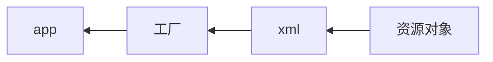

<h1>Spring</h1>
Spring核心：IOC/DI  、AOP、声明式事务

Inverse of Control：控制反转

Dependency Inject：依赖注入

Aspect Oriented Programming：面向切面编程

---


<center>Contents</center>
[TOC]

---

### 一、一站式开发

> Struts2（web层）—— Spring（业务层）——Hibernate（持久层）
>
> Spring管理整合Struts2，Hibernate等
>
> 方便解耦，简化开发，事务自动管理

### 二、IOC

> Inverse of Control：控制反转
>
> 对象的创建权交给给Spring，解决程序耦合性高的问题



> 工厂由Spring提供
>
> xml中记录需要有Spring管理的实现类

6个IOC基本包：

> spring:
>
> ​	core（核心类包）、expression（SPEL表达式）、beans（Bean）、context（上下文）
>
> org.apache:
>
> ​	commons：logging
>
> ​	log4

**IOC的编写过程**

1. 下载spring以及其依赖包，并导入

2. 包结构：接口+实现类

3. 将实现类交给Spring

   新建spring配置文件：```src/applicationContext.xml```

   xml约束：```spring包/docs/…reference…./html/xsd….configuration…html最后的bean```

   ```xml
   <?xml version="1.0" encoding=UTF-8?>
   <约束..../>
   <beans>
       <bean id="为实现类指定id" class="实现类的完整路径"></bean>
   </beans>
   ```

4. 使用工厂获取对象

   ```java
   //创建工厂
   ApplicationContext ac = new ClassPathXmlApplicationContext("配置文件名");
   //从工厂获取对象
   接口类 对象 = (实现类) ac.getBean("实现类id");
   //使用对象
   对象.xxx();
   ```

   工厂：```ApplicationContext接口```，```BeanFactory接口（过时）```

   ```
   ApplicationContext接口的实现类：
   	ClassPathXmlApplicationContext	读取src目录的配置文件，加载完就创建对象
   	FileSystemXmlApplicaionContext	读取文件系统，使用getBean时创建对象
   ```

### 三、Spring配置文件

```xml
<约束/>
<import resource="引入配置文件"/>
<beans>
    <bean id="实现类id" 	不能使用特殊字符
          name="实现类名"	与id同效，可以使用特殊字符1
          class="实现类路径"
          scope="singleton默认"	作用范围
          		singleton	单例，运行时只能创建一个对象
          		prototype	多例，每次调用都创建新对象，Action使用多例，线程安全
          		request,session,globalsession(全局web应用)
          init-method="初始化时调用的方法名"
          destroy-method=""
    </bean>
</beans>
```

有多个配置文件时，既可以使用import标签，也可以同时加载多个配置文件：

```java
ApplicationContext ac = new ClassPathXmlApplicationContext("1.xml","2.xml")
```


### 四、DI

> Dependency Inject  依赖注入：
>
> ​	app类需要dao类的方法；spring负责创建dao对象，并将其注入到app

> Spring自动调用setter方法来为对象注入属性值

1. 注入属性

   ```xml
   <bean id="xxx" class="xxx">
       <property name="成员变量名" value="值"/>
   </bean>
   ```

2. 注入对象

   ```xml
   <property name="成员类对象" ref="类对象的id"/>
   ref 来引用
   ```

3. 注入构造方法(默认使用无参数的构造方法)

   ```xml
   <bean id="xxx" class="xxx">
       <constructor-arg name="构造方法参数1" value="值"/>
       <constructor-arg name="构造方法参数2" ref="对象id"/>
       ...
   </bean>
   ```

4. 注入集合

   * 注入数组或List集合

     ```xml
     <property name="arrs">
         <list>
             <value>值1</value>
             <value>值2</value>
             ....
             或者
             <ref bean="对象id"/>
             ...
         </list>
     </property>
     ```

   * 注入Set集合

     ```xml
     <Set>
         <value>值1</value>
         ...
         或
         <ref bean="对象id"/>
         ...
     </Set>
     ```

   * 注入Map集合

     ```xml
     <map>
         <entry key="键" value="值"/>
         ...
         或
         <entry key-ref="" ref="对象id"/>
     </map>
     ```

   * 注入属性文件（Properties类）

     ```xml
     <props>
         <prop key="键">值</prop>
         ...
     </props>
     ```


### 五、IOC注解

* 注解的目的：简化配置文件

1. 导入包：spring-aop

2. 接口 + 带注解的实现类

   ```java
   @Component(value="设置id") //默认类名，首字母小写
   public class 实现类名{
       @Value(value="注入值")
       String name;
       @Resource(name="要注入的对象Id")
       Animal dog;
       public void cry(){ ...}
   }
   ```

   <a href="anno">IOC和DI注解</a>

   * 用在类上（IOC）

     > 通用：
     >
     > ​	@Component(value=“id”)		将类交给IOC容器管理
     >
     > ​	@Scope(value=“singleton”)	对象的作用范围
     >
     > 
     >
     > 专用：与@Component相同作用，不能同时使用
     >
     > ​	@Controller(value=“id”)	用于web层
     >
     > ​	@Service(value=“id”)		用于业务层
     >
     > ​	@Repository(value=“id”)	用于持久层

   * 用于注入（DI）

     >用在属性上
     >
     >​	@Value(value=“值”)	注入基本数据类型和String
     >
     >​	@Autowried	自动注入对象（多个对象会出错）
     >
     >根据类id注入对象
     >
     >​	@Autowired + @Qualifier(value=“id”)
     >
     >​	或者使用
     >
     >​	@Resource(name=“id”)	（java提供的注解）

3. 配置文件开启注解扫描

   ```xml
   约束：spring/docs/html/xsd.configuration.html  的 context部分
   <beans ....>
       <context:component-scan base-package="要扫描的包"/>
   </beans>
   ```

4. 编写测试类，获取工厂，获取对象，调用方法

---


### 六、Spring整合JUnit方便测试

需要的包：JUnit4、spring-test

在测试类上加注解

```java
@RunWith(SpringJUnit4ClassRunner.class)
@ContextConfiguration("classpath:applicationContext.xml")
public class SpringTest{
    @Resource(name="要测试的对象id")
    private 测试对象的接口 测试对象;//注入测试对象
    public void run(){...}
}
```

---

### 七、Spring整合Struts2

*Action中的业务层对象交由Spring*

<font size=4>使用Spring的 ApplicationContext 对象getBean(“id”) 为Action注入对象，but ，Action是多例的，由Struts创建，每次请求都会创建Action对象，并注入业务类对象，需要重复加载applicationContext.xml  !!! ，内存告急</font>

<font color="black">Spring-web 整合 使用监听器来加载Spring配置文件，使用WebApplicationContext对象来getBean</font>

```启动服务器 -> 创建ServletContext对象``` ```监听器捕获ServletContext对象创建事件，执行一些操作```

  web.xml配置监听器：

```xml
<web-apps>
    <listener><!--写在web.xml的最前面，加载WEB-INF/下的配置文件-->
        <listener-class>.....ContextLoaderListener</listener-class>
    </listener>
    <context-param><!--配置监听器要加载的配置文件-->
        <param-name>contextConfigLocation</param-name>
        <param-value>classpath:applicationContext.xml</param-value>
    </context-param>
</web-apps>
```

Action中注入业务层实现类

```java
ServletContext sc = ServletActionContext.getServlet();//获取servletContext对象
WebApplicationContext webContext = WebApplicationContextUtils.getWebApplicationContext(sc);//创建对象，spring配置包含在里面
	()webContext.getBean("id");//注入对象
```


---

### 八、AOP

Aspect Oriented Programmin：面向切面编程

OOP：面向对象编程，AOP是OOP的延续而不是替代

在不修改源码的情况下新增功能

横向抽取机制取代传统纵向继承（高耦合）机制

* AOP原理：代理

  > 为目标对象（需要增强的类）创建代理，代理对象代理的方法被执行就会回调invoke方法，在invoke方法中添加增强功能。

  ```
  不使用AOP：
  	接口 - 实现类 - 测试类直接访问实现类
  使用AOP：
  	接口 - 实现类 - 生成实现类的代理对象 - 测试类获取代理对象并调用代理方法 - 代理方法被执行，自动回调invoke方法（在invoke方法新增代码即是增强功能）
  ```

* 代理方式自动选择：

  > 有接口的情况下：jdk动态代理
  >
  > 无接口的情况下：cglib技术（采用生成类的子类的方式）

* ***Spring AOP术语***

  |         名称 | 说明          | 含义                                                         |
  | -----------: | :------------ | :----------------------------------------------------------- |
  |    joinpoint | 连接点        | 一个类中可以所有方法都可以是连接点，这些方法都可以被增强/拦截 |
  |     pointcut | **切入点**    | 被增强/拦截的方法                                            |
  |       advice | **增强/通知** | 具体的增强（功能）                                           |
  |       target | 目标对象      | 被代理/要增强的对象                                          |
  |      weaving | 织入          | 把增强应用到目标对象的来生成代理的过程                       |
  |       aspect | **切面**      | 切入点+通知                                                  |
  |        proxy | 代理          |                                                              |
  | introduction | 引介          |                                                              |

  **通知需要编写，切入点需要配置**

* **AOP使用流程**

  1. 导包

     ```
     spring核心包、spring-aop、spring-aspect
     com.springsource.org.aopaliance
     com.springsource.org.aspectj.weaver
     ```

  2. 接口 + 实现类（目标对象）

  3. 切面类（编写要增强的功能方法）

  4. spring配置文件

     **切入点表达式**：[查看](#pointcut)

     ```
     execution( public void packages.实现类.方法())
     含义：当实现类中的 public void 方法() 执行时，对其增强
     execution( * packages.类.*(..) )
     含义：对实现类中的 任何返回类型 的 任何方法 执行时，对其增强
     ```

     ```xml
     <!--约束 spring配置约束的 aop部分-->
     
     <!--将实现类和切面类交给IOC容器-->
     <beans id="被增强类id" class="被增强类path"></beans>
     <beans id="带有通知的类id" class="带有通知类path"></beans>
     
     <aop:config><!--aop配置-->
         <aop:aspect ref="通知类id"><!--切面配置-->
             <aop:before method="通知类中的增强方法"
                         pointcut="切入点表达式"/><!--定义通知-->
         </aop:aspect>
     </aop:config>
     ```

* 切入点表达式<a name="pointcut"></a>

  ```execution( public void com.aop.Imp.save())```

  1. execution（）固定写法;
  2. 方法权限 public 可以不写
  3. 返回类型 void，可以写``` * ```表示任意返回值
  4. 包名 可以出现```*```通配符，也可以简写为 ```*..*.类.方法()``` ，```*..*```表示任意路径
  5. 类名 可以写```*Imp```表示以Imp结尾的类
  6. 方法 ```save*()```表示以save开头的方法
  7. 方法参数 ```save(*)```表示一个参数，```save(..)```表示任意参数

* 通知类型：

  执行顺序：before -> after -> afterReturning

  1. ```<aop:before>```前置通知，切入点执行前通知/增强

  2. ```<aop:after-returning>```后置通知，切入点执行成功后通知/增强

  3. ```<aop:after>```最终通知，无论切入点执行成功与否，都在其后通知

  4. ```<aop:throwing```异常抛出通知，切入点异常后通知

  5. ```<aop:around>```环绕通知，切入点执行前后都通知，异常不通知，而且需要在通知中手动执行切入点：
  
     ```java
     切面类中方法：
     public void around(ProceedingJoinPoint jionPoint){
     	切入点执行前的增强;
     	try{
     		jionPoint.proceed();//执行切入点
     	}catch(Throwable e){ 抛出异常;}
     	切入点执行成功后的增强;
     }
     ```

---

### 九、AOP注解

1. 导包

   IOC基本包，spring-aop，spring-aspect ，org.aopaliance，org.aspectj.weaver

2. 接口+实现类

3. 切面类

   ```java
   @Componnet
   @Aspect
   public class 切面类{
       @Before(value="切入点表达式")//其他通知类型同理
       public void 增强(){....}
       
       //自定义切入点，有了该方法，可以使用 类.pointcut() 取代 切入点表达式
       @Pointcut(value="切入点表达式")
       public void pointcut(){}
   }
   ```

4. 配置文件

   ```xml
   <!--约束-->
   <!--将目标对象和切面类交给IOC容器-->
   <bean id="目标对象id" class="路径" />
   <bean id="切面类id" class="路径"/>
   <!--开启自动代理-->
   <aop:aspectj-autoproxy/>
   ```
   
5. 编写测试类

   ```java
   @RunWith(SpringJUint4ClassRunner.class)
   @ContextConfiguration("classpath:xxx.xml")
   public class AOPTest{
       @Resource(name="目标对象id")
       private 接口 实现类对象;
       @Test
       public void test(){
           实现类对象.切入点();
       }
   }
   ```

---

### 十、Spring  Jdbc模板

Spring Jdbc模板 **JdbcTemplate类**

**实际操作数据库的是底层Connection对象，Connection对象放在连接池中**

1. 连接池：dataSource（可以使用IOC和DI）

   * Spring连接池：DriverManagerDataSource

     ```java
     org.springframework.jdbc.datasource.DriverManagerDataSource
     //实例方法
     /* setDriverClassName("数据库驱动路径");
      * setUrl("jdbc:mysql://....");
      * setUsername("user");
      * setPassword("password");
      */
     ```

   * DBCP连接池(apache)：BasicDataSource

     ```java
     org.apache.commons.dbcp.BasicDataSource
     //实例方法同上
     ```

   * C3P0连接池：ComboPooledDataSource

     ```java
     com.mchange.v2.c3p0.ComboPooledDataSource
     /* 实例方法
      * setDriverClass();
      * setJdbcUrl();
      * setUser();
      * setPassword();
      */
     ```

2. lJdbc 模板类 JdbcTemplate

   ```java
   org.springframework.jdbc.core.JdbcTemplate
   ```

   ```java
   JdbcTemplate tmplate = new JdbcTemplate();//可以使用IOC
   template.setDataSource(连接池对象);//可以用DI
   ```

   JdbcTemplate实例方法

   ```java
   // update方法，操作增删改
   template.update(sql,sql中第一个？代表的值,第二个？,...)
   // 查询
   //编写表的映射JavaBean
       class User{ 各个与字段对应的属性，setter和getter}
   //实现 RowMapper<E>接口的类，将查询结果封装为JavaBean对象
   class BeanMapper implements RowMapper<User>{
       @Override
       public User mapRow(ResultSet rs,int rowNum) throw SQLException{
           User u = new User();
           u.set属性(rs.get类型("字段"));
           //...其他属性
           return u;
       }
   }
   
   // 通过主键查询一条记录,返回JavaBean对象
   template.queryForObject(sql,new BeanMapper,各个？的值);
   //查询多条记录，返回JavaBean对象组成的List对象
   template.query(sql,new BeanMapper,各个？的值);
   ```

   <font color="red">JdbcDaoSupport类</font>

   ```java
   JdbcDaoSupport类中有 JdbcTemplate对象，以及其setter和getter;
   操纵数据库只需继承JdbcDaoSupport类，取出其JdbcTemplate对象；
   使用IOC时，将已经注入dataSource的template对象注入到JdbcDaoSupport子类的template，使用template直接通过getter取出；
   JdbcDaoSupport类还提供了setDataSource方法，为其子类dataSource属性注入连接池对象，该类对象就自动为其template属性设置连接池；
   ```

* 导包：IOC包，spring-aop，mysql驱动，spring-jdbc，spring-tx

* IOC和DI

  将 DriverManagerDataSource，JdbcTemplate交给IOC容器管理

  将DriverManagerDataSource和JdbcTemplate的set方法使用DI

* JDBC 模板 JdbcTemplate

  ```java
  JdbcTemplate template = new JdbcTamplate();
  template.setDataSource(dataSource);
  tmplate.update("sql语句");
  ```

---

### 十一、Spring事务管理

* Spring使用三个接口来管理事务

  * ```PlatformTransactionManager接口```：平台事务管理器，不同的平台使用不同的实现类
  * ```TransactionDefinition接口```：事务定义，设置事务的隔离级别，[传播行为](#传播行为)
  * ```TransactionStatus接口```：事务状态

* ##### PlatformTransactionManager接口的常用实现类

  1. Jdbc模板或MyBaits使用：```DataSourceTransactionManager```
  2. hibernate框架使用：```HibernateTransactionManager```

* ## Spring管理事务

  1. 声明式管理

     配置连接池，平台管理器（注入连接池），业务类，数据库层方法

     切面类和通知由Spring提供

     * xml方式

       ```xml
       <!--配置通知-->
       <tx:advice id="通知名" 
                  transaction-manager="平台管理接口实现类">
           <tx:attributes>
               <tx:method name="切入点/要通知的方法"/>
               ......
           </tx:attributes>
       </tx:advice>
       <!--配置切面-->
       <aop:config>
           <aop:advisor advice-ref="通知名"
                        pointcut="切入点表达式"/>
       </aop:config>
       ```

     * 注解方式

       开启事务注解：

       ```xml
       <tx:annotaion-drien 
                           transaction-manager="平台事务实现类"/>
       ```

       ```java
       @Transactional
       用在类上：所有方法都通知；用在方法上：指定方法通知
       @Transactional(隔离级别属性，传播行为);//不写就使用默认值
       ```

  2. 编程式管理（手动写代码）

* 传播行为<a name="传播行为"></a>

  ```java
  class serveice{
      void A(){事务;B();}
      void B(){事务;}
  }
  ```

  为事务设置传播行为可以管理业务层间的事务调用

  ```java
  PROPAGATION_REQUERED 默认，保证A和B在同一事务中
  PROPAGATION_REQUERED_NEW 保证A和B不在同一事务中
  PROPAGATION_NESTED	A执行后设置保存点，如果B异常，回滚到保存点或最初
  ```

  