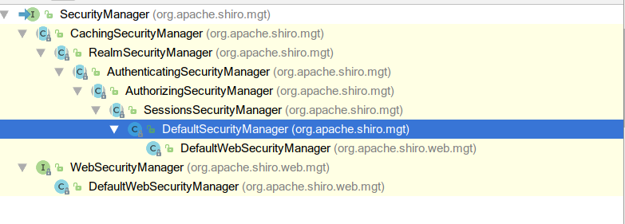

<h1>Apache Shiro</h1>
开源安全管理框架：身份认证、授权、会话管理、加密、缓存等

shiro不需要依赖Spring，相对简单

---

<center>contents</center>
[TOC]

---

#### 名词介绍

* authentication : 身份认证      authenticator 认证器
* authorization : 授权                authorizer 授权器
* session management : 会话管理
* cryptography : 加密


#### 1. shiro 架构

* subject 实体：当前与应用交互的实体（用户、第三方应用等），用于获取主体信息（principal、credential）
* security manager ：shiro的核心，协调管理其他组件工作
* realm : 域，安全管理相关的dao，负责从数据源（数据库或文件）查询数据，可以有多个realm

```java
SecurityManager接口继承了Authenticator, Authorizer, SessionManager接口,
其实现类逐渐现实具体功能，到DefualtSecurityManager已经完成来所有接口方法的实现
```



#### 2. 身份认证：Authentication

* 认证流程：

  ```shell
  将token交给subject 
  -> subject将用户信息交给security manager
  -> security manager 调用认证器
  -> 认证器根据配置的realm调用策略
  -> 根据策略调用realm
  ```

* 编写流程

  1. 通过shiro相关api 创建security manager 来获取subject实例

  2. 封装token信息

  3. 通过subject.login(token)进行用户认证

     ```shell
     subject接收token后通过其实现类DelegatingSubject将token委托给secuttiry manager，
     通过其实现类DefaultSecurityManager的login来完成认证,
     在其父类AuthenticatingSecurityManager已经实现了该功能（通过调用认证器Authenticator）
     Authenticator接口默认实现类为ModularRealmAuthenticator（父类AbstractAuthenticator的认证方法通过调用doAuthenticate抽象方法实现），所以ModularRealmAuthenticator实现了doAuthenticate；
     doAuthenticate方法获取realms信息，（iniRealm读取ini文件）；
     如果只有一个realm：直接将token和realm中的数据比较
     如果是多个realm：通过Authentication Strategy (认证策略)来进行认证
     认证完成
     ```

  4. 如果认证失败，抛出异常信息

##### shiro.ini配置文件

```ini
-----------------------------------------
# 用户段，配置用户
[users]
# 用户名=密码, 角色
user1 = 123, role1
user2 = 123
-----------------------------------------
# 角色段
[roles]
# 角色=权限
role1 = user:add,user:delete
-----------------------------------------
# mian段 配置SecurityManager或依赖
[main]
#定义一个realm
MyRealm = com.xxx.MyRealm
#注入该realm
securityManager.realm = MyRealm
-----------------------------------------
```


```java
public static void main(String[] args) {
    //创建security manager 工厂 读取配置文件
    Factory<SecurityManager> factory = new IniSecurityManagerFactory("classpath:shiro.ini");
    //通过工厂获取 securtiy manager 实例
    SecurityManager manager = factory.getInstance();
    //将security manager 实例 设置到运行环境
    SecurityUtils.setSecurityManager(manager);
    //通过SecurityUtils来获取实体 subject
    Subject subject = SecurityUtils.getSubject();
    //登录测试：
    UsernamePasswordToken token = new UsernamePasswordToken("Abi", "13");
    //进行用户身份认证
    try{
        subject.login(token);
        //        判断用户是否通过认证 认证失败异常AuthenticationException
        if (subject.isAuthenticated()) System.out.println("登录成功");
    }catch (AuthenticationException e){
        e.printStackTrace();
        System.out.println("用户名或密码错误");
    }
}
```

* 认证过程的父异常：AuthenticationException

  虽然提供了详细的异常分类，为了保证安全只提供给用户模糊的异常信息

  * 账户失效：DisabledAccountException
  * 输入次数过多：ExcessiveAttemptsException
  * 用户不正确：UnknownAccountException
  * 凭证错误：IncorrectCredentialsException
  * 凭证过期：ExpiredCredentialsException

##### jdbcRealm 通过数据库实现认证

默认使用IniRealm ，使用其他realm需要配置

```ini
[main]
# 定义数据源 使用c3p0
dataSource = com.mchange.v2.c3p0.ComboPooledDataSource
dataSource.driverClass = com.mysql.jdbc.Driver
dataSource.user = jissi
dataSource.password = jissi
dataSource.jdbcUrl = jdbc:mysql://123.56.158.88:3306/Demo

jdbcRealm = org.apache.shiro.realm.jdbc.JdbcRealm
jdbcRealm.dataSource = $dataSource # 引用对象
securityManager.realm = $jdbcRealm # 引用对象
```

* 观察JdbcRealm源码
  * 需要指定dataSource
  * 需要users表，包含：username、password 、password_salt

##### Authentication Strategy 认证策略(多个realm才有效)

三种认证策略：默认AtLeastOneSuccessfulStrategy

| 策略                         | 说明                                                         |
| ---------------------------- | ------------------------------------------------------------ |
| AtLeastOneSuccessfulStrategy | 至少有一个Realm验证成功，那么认证将被视为成功   全部验证一遍 |
| FirstSuccessfulStrategy      | 只要有Realm验证成功，整体认证将被视为成功，成功后不再验证    |
| AllSuccessfulStrategy        | 所有Realm成功，认证才视为成功                                |

* 设置认证策略

```ini
authenticationStrategy = org.apache.shiro.authc.pam.AllSuccessfulStrategy
securityManager.authenticator.authenticationStrategy = $authenticationStrategy
```


##### 散列算法：加密

身份认证过程会涉及加密来保证数据安全

shiro实现的散列算法：md5 、sha 等，并提供加盐（salt）功能（直接md5加密容易找到源码）

```java
Md5Hash md5Hash = new Md5Hash("1111");//直接加密
System.out.println(md5Hash.toString());
Md5Hash md5Salt = new Md5Hash("1111","123");//加盐
System.out.println(md5Salt.toString());
md5Salt = new Md5Hash("1111","123",3);//加盐迭代加密
System.out.println(md5Salt.toString());
```


* 配置文件

  ```ini
  [main]
  # 自定义Realm
  userRealm = com.shro.UserRealm
  # 加密方式
  credentialsMatcher = org.apache.shiro.authc.credential.Md5CredentialsMatcher
  credentialsMatcher.hashAlgorithmName = MD5
  # 迭代次数
  credentialsMatcher.hashIterations = 1
  userRealm = com.shro.UserRealm
  userRealm.credentialsMatcher = $credentialsMatcher
  securityManager.realm = $userRealm
  ```

* [UserRealm](#userRealm) 返回的SimpleAuthenticationInfo 带盐  

  ```java
  SimpleAuthenticationInfo info =
      new SimpleAuthenticationInfo(username, password,
                                   ByteSource.Util.bytes(salt),getName());
  ```

  

#### 3. 自定义realm  只需返回正确的用户信息给shiro

由于jdbcRealm灵活性太差（表和字段都已经写死）

Realm接口的方法：getAuthenticationInfo()根据token去数据源拿到认证信息

* shiro实现了不同的realm
  * AuthenticatingRealm实现了getAuthenticationInfo()方法
  * AuthorizingRealm实现了获取权限的功能

* 通常<a name="userRealm">自定义realm</a>需要继承AuthorizingRealm（它包含了认证和授权）

```java
public class UserRealm extends AuthorizingRealm {
    @Override
    public String getName() {return "userRealm";}
    // 身份认证(仅仅从数据库取数据，交给shiro认证)
    protected AuthenticationInfo doGetAuthenticationInfo(AuthenticationToken authenticationToken) throws AuthenticationException {
        // 获取用户输入的用户名：身份信息
        String username = (String)authenticationToken.getPrincipal();
        // 根据用户名去数据库查询密码 :凭证信息
        String password = SearchUser.getPassword(username);
        // 将从数据库查询到的正确认证信息封装SimpleAuthenticationInfo 并返回
        SimpleAuthenticationInfo info = new SimpleAuthenticationInfo(username,password,getName());
        return info;
    }
    //授权 仅仅从数据库查询权限返回
    protected AuthorizationInfo doGetAuthorizationInfo(PrincipalCollection principalCollection) {
        String username = principalCollection.getPrimaryPrincipal().toString();
        // 去数据库查询该用户对应的权限信息
        List<String> permission = new ArrayList<>();
        permission.add("user:add");
        permission.add("user:del");
        permission.add("user:update");
        //封装权限信息
        SimpleAuthorizationInfo info = new SimpleAuthorizationInfo();
        info.addStringPermissions(permission);
        return info;
    }
}
```


#### 4. 授权 Authorization 访问控制

授权：给通过认证的用户授予资源访问权限

授权粒度：粗粒度---对整个表的操作(如对user的crud)；细粒度---对记录的一部分操作(如 查看 id=1的user工资)

shiro一般管理粗粒度权限：菜单、url、按钮等，细粒度权限一般由业务控制

角色：权限的集合，方便权限管理

* 权限表示规则

  ```ini
  资源:权限:实例 可以使用通配符
  user:add 表示对user有添加的权限
  user:*   表示对user有所有操作权限
  user:delete:100 表示对user 标识为 100 的记录有删除权限(细粒度)
  ```

* shiro授权流程

  ```ini
  [users]
  # 用户名=密码,角色 正确的用户信息
  test = 123,role1
  Abi = 123,role2
  # 定义角色
  [roles]
  role1=user:add,user:update:user:delete
  role=user:*
  ```

  ```java
  认证完成后，检查权限
  hasXX,isXX 返回boolean值，不抛出异常
  checkXX 返回boolean 没有权限抛出异常
  // 基于角色的授权
  subject.hasRole("role2")、hasRoles();
  subject.checkRole("role2")、subject.checkRoles("role2","role1");
  // 基于资源的授权
  subject.isPermitted("user:add");
  subject.checkPermission("user:add");
  ```

  

  ```shell
  1. 获取dubject主体
  2. 判断主体是否通过认证
  3. 调用has*/is*/check* 进行权限判断
     由其实现类DelegatingSubject将处理工作交给securityManager
     由其实现类defaultSecurityManager来处理，
     由其父类AuthorizingSecurityManager来处理，
     该类将处理交给Authorizer来处理，
     由其实现类ModularRealmAuthorizer来处理，
     通过调用realm来获取数据，该realm中的PermissionResolver将字符解析交给其子类WildcardPermissionResolver来解析，
     该类将处理交给WildcardPermission处理
     返回处理结果
  ```

  

  ##### 权限检查方式：编程式、注解式、标签式

  * 编程式（常用于se）：subject.hasRole("role1")

  * 注解式（常用于web）：执行方法前检查权限

    ```java
    @RequiresRoles({"admin","user"})
    // @RequiresPermissions({"user:lsit","user:del"})
    public void findAll(){....}
    在处理方法上可以取代url拦截
    ```
  ```
  
  ```
  
* 标签式：jsp页面示例
  
    ```jsp
    <%@taglib prefix="shiro" uri="http://shiro.apache.org/tags" %>
    <shiro:hasPermission name="user:update">
        <a href=xxx>更新</a>
    </shiro:hasPermission>
  ```
  
  

##### 自定义realm实现授权

已有的JdhcRealm写死了 user_roles表需要 role_name、username\ roles_permissions表需要 role_name、permission

去数据库获取角色、权限


#### 5. shiro SSM 

失败信息异常报错在 request的 “shiroLoginFailure”

* web xml

```xml
<!--shiro过滤器-->
<filter>
    <filter-name>shiroFilter</filter-name>
    <!--spring创建对象，交给servlet容器管理-->
    <filter-class>org.springframework.web.filter.DelegatingFilterProxy</filter-class>
    <init-param>
        <!--生命周期由servlet控制-->
        <param-name>targetFilterLifecycle</param-name>
        <param-value>true</param-value>
    </init-param>
</filter>
<filter-mapping>
    <filter-name>shiroFilter</filter-name>
    <url-pattern>/*</url-pattern>
</filter-mapping>
<context-param>
    <param-name>contextConfigLocation</param-name>
    <param-value>classpath:applicationContext.xml,classpath:shiro.xml</param-value>
</context-param>
```

* applicationContext.xml ：配置数据源，包扫描，mybatis，声明式事务
* springMvc.xml : 包扫描，视图解析器，shiro 注解
* shiro.xml


#### 6. 使用缓存

不使用缓存的情况下，每次访问需要检查权限都要查询数据库；

shiro可以和ehcache和redis集成来实现缓存

* 使用ehcache

  shiro默认集成了ehcache的配置，如果自定义放在classpath下

shiro配置

```xml
<!--缓存管理器  在security manager注入-->
<bean id="cacheManager" class="org.apache.shiro.cache.ehcache.EhCacheManager">
    <property name="cacheManagerConfigFile" value="classpath:ehcache.xml"/>
</bean>
```


缓存管理器，如果运行过程中缓存需要发生变化，需要在realm中重写清理缓存的方法

```java
/**
 * 清理缓存,不重写父类方法，在业务层手动调用
 */
public void clearCache() {
    super.clearCache(SecurityUtils.getSubject().getPrincipals());
}
```


#### 7.session管理

shiro.xml

```xml
<!--session管理器 失效时间ms，删除失效的session  securityManager注入-->
<bean  id="sessionManager" class="org.apache.shiro.web.session.mgt.DefaultWebSessionManager">
    <property name="globalSessionTimeout" value="300000"/><!--失效时间 ms-->
    <property name="deleteInvalidSessions" value="true"/>
</bean>
```


#### 8.remember me

使用coockie实现

shiro.xml

```xml
<!--记住我  注入到security manager-->
<bean id="rememberMeManager" class="org.apache.shiro.web.mgt.CookieRememberMeManager">
    <property name="cookie" ref="cookie"/>
</bean>
<!--cookie  用户信息必须序列化-->
<bean id="cookie" class="org.apache.shiro.web.servlet.SimpleCookie">
    <property name="maxAge" value="604800"/><!--保存时间 7天-->
    <property name="name" value="rememberMe"/><!--名称-->
</bean>

<!--在过滤链中配置可以使用 记住我访问的url-->
/inedx=user
```

