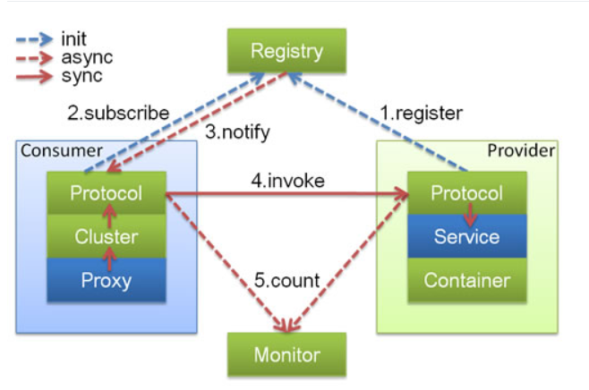

### Dubbo

[TOC]

---

### 一、SOA(面向服务架构)

* Service Oriented Ambiguity
  * 专门提供服务的单元
  * 其他单元调用服务单元

* SOA定位：
  * 如何设计项目
  * SOA是一种思想
* 以前的架构设计
  * 所有项目都要访问数据库
  * 数据库访问层代码冗余(如实体类和mapper)

* SOA架构
  * 专门访问数据库的服务(项目)
  * 实现数据访问控制和代码复用
* 实现SOA架构的服务框架
  * Dubbo
  * WebService
  * Dubbox
  * 服务作为web项目，调用web项目的控制层
    * 使用HttpClient调用其他服务控制器

### 二、分布式、集群、微服务

* **分布式**：不同模块部署在不同服务器上，一个业务分拆多个子业务，部署在不同的服务器上
  
  * 作用：分布式解决网站高并发带来问题
  
* **集群**：多台服务器部署相同应用构成一个集群，同一个业务，部署在多个服务器上
  
* 作用：通过负载均衡设备共同对外提供服务
  
* **微服务**：架构设计概念，使用小服务或者单一业务来开发单个应用的方式或途径

  微服务架构特点：

  - 单一职责
  - 服务粒度小
  - 面向服务（对外暴露REST api）
  - 服务之间相互独立

### 三、RPC（远程过程调用协议）

* Remote Procedure Call Protocol

* RPC解析：

  客户端通过互联网调用远程服务器，客户端只知道远程服务器提供的工作，不知道其具体实现

* **RPC优点 **：安全性——服务器只提供功能列表，不提供具体的功能实现

* 基于socket，速度快，效率高


### 四、Dubbo

分布式、高性能、透明化的RPC服务框架

服务自动注册、自动发现

#### 4.1 Dubbo架构



蓝色虚线 -- 初始化时调用，红色虚线 -- 运行时异步调用，红色实线 -- 运行时同步调用

所有服务都可以在独立服务器运行，必须遵守特定协议

* Provider：服务提供方（发布方，一般进行数据访问）
  * Container：依赖Spring容器，强耦合
* Consumer：服务调用方
* Registry：注册中心：在容器启动时将所有可以提供的服务注册，告诉Consumer提供了哪些服务以及服务方在哪
* Monitor：监听Consumer和Provider的调用信息

#### 4.2 运行原理

1. 启动容器，相当于启动Dubbo的Provider
2. 去注册中心注册所有可以提供的服务列表  -- register
3. Consumer去注册中心获取到服务列表和Provider地址 -- subscribe
4. 当Provider有修改时，注册中心将消息推送给Consumer -- notify
   * 观察者（发布/订阅）设计模式：被观察者(发布方)Redistry，观察者(订阅方)Consumer
5. Consumer根据获取到的Provider地址，(通过代理对象)真实调用Provider中的功能  -- invoke
   * 在Consumer方式使用动态代理设计模式：创建一个Provider方类的代理对象，通过代理对象访问真实功能，起到保护Provider真实功能
   * 同步调用：Dubbo最耗时部分
6. 监听器Monitor：Consumer和Provider每隔一分钟向Monitor发送统计信息(访问次数、频率等) -- count


#### 4.3 注册中心

Dubbo支持 Zookeeper、Nacos、Redis、Multicast、Simple五种注册中心，推荐Zookeeper

| 类型      | 优点                       | 缺点                        |
| --------- | -------------------------- | --------------------------- |
| Zookeeper | 支持网络集群               | 依赖于Zookeeper软件的稳定性 |
| Redis     | 性能高                     | 对服务器环境要求高          |
| Multicast | 不需要安装其他软件         | 局域网内使用                |
| Simple    | 只适用测试环境，不支持集群 |                             |


### 五、Zookeeper

分布式协调组件，本质是一个软件，使用Java语言编写

#### 5.1 常用功能

* 发布订阅功能
* 分布式/集群管理功能

#### 5.2 安装Zookeeper

```shell
wget http://archive.apache.org/dist/zookeeper/zookeeper-3.3.3/zookeeper-3.3.3.tar.gz
tar zxvf zookeeper-3.3.3.tar.gz
cd zookeeper-3.3.3
cp conf/zoo_sample.cfg conf/zoo.cfg

vi conf/zoo.cfg
tickTime=2000
initLimit=10
syncLimit=5
dataDir=/home/dubbo/zookeeper-3.3.3/data
clientPort=2181  #在防火墙放行该端口
# 集群配置
#server.1=10.20.153.10:2555:3555
#server.2=10.20.153.11:2555:3555
#集群配置
mkdir data
echo 1 >> myid #声明当前为server.1

./bin/zkServer.sh start #启动
./bin/zkServer.sh status # 检查状况
./bin/zkServer.sh stop # 关闭
```

#### 六、Dubbo支持的协议

| 类型    | 优点                                      | 缺点                              |
| ------- | ----------------------------------------- | --------------------------------- |
| Dubbo   | 使用NIO和线程池处理                       | 大文件传输可能失败                |
| Rmi     | JDK提供的远程方法调用协议，不需要额外配置 | 偶尔连接失败                      |
| Hessian | 基于HTTP                                  | 需要hessian.jar，Http短连接开销大 |


### 七、Provider搭建

新建maven项目

#### 7.1 新建maven子项目：该项目只写 服务接口

#### 7.2 新增maven子项目，依赖接口项目，编写接口实现类 

（接口与实现类写在一起消费方需要依赖provider，不能达到RPC保护实现类的目的）

##### dubbo依赖包

```xml
<!-- 打包方式 jar-->
<!-- 依赖接口项目 -->
<dependency>
    <groupId>com.alibaba</groupId>
    <artifactId>dubbo</artifactId>
    <version>2.6.2</version>
</dependency>
<!-- zookpepper客户端 之前使用 zkclient,2.6以后使用curator-->
<dependency>
    <groupId>org.apache.curator</groupId>
    <artifactId>curator-framework</artifactId>
    <version>2.12.0</version>
</dependency>
```

##### 编写接口实现类

##### dobbo配置文件 resource/dubbo.xml

```xml
<beans xmlns:xsi="http://www.w3.org/2001/XMLSchema-instance"
       xmlns:dubbo="http://dubbo.apache.org/schema/dubbo"
       xmlns="http://www.springframework.org/schema/beans"
       xsi:schemaLocation="http://www.springframework.org/schema/beans http://www.springframework.org/schema/beans/spring-beans.xsd
                           http://dubbo.apache.org/schema/dubbo http://dubbo.apache.org/schema/dubbo/dubbo.xsd">
    <!--    区分 provider 名称-->
    <dubbo:application name="provider-demo"/>
    <!--    注册中心地址，协议-->
    <dubbo:registry address="zookeeper://127.0.0.1:2181"/>
    <!--    服务所在服务器的端口，以及调用时使用的协议-->
    <dubbo:protocol name="dubbo" port="8090"/>
    <!--    注册功能：注册接口-->
    <dubbo:service interface="com.demo.DemoService" ref="demo"/>
    <bean id="demo" class="com.provider.impl.DemoImpl"/>
    <!--通过包扫描配置 注册接口  @Service注解(dubbo的)，不能与@Transactional同时使用-->
    <!-- <dubbo:annotation package=""/>-->
</beans>
```

##### 启动容器

1. 通过Spring启动

   ```java
   ClassPathXmlApplicationContext context = new ClassPathXmlApplicationContext("dubbo.xml");
   context.start();
   System.in.read();//保持服务开启，直到接收到输入
   ```

2. dubbo写法（推荐）

   ```java
   // 要求 dubbo的配置文件 必须唯一 类路径/META-INF/spring/xx.xml  
   Main.main(args);
   ```


### 八、Consumer搭建

创建consumer子模块，依赖项与provider完全一致

编写正常的项目，在service层编写业务接口和实现类，在实现类中调用远程服务

```java
public class TestServiceImp implements TestService {
    @Reference//从注册中心获取代理对象
    DemoService demoService;
    @Override
    public String getName(String name) {
        return demoService.printName(name);
    }
}
```

创建dubbo配置文件  resource/dubbo.xml

```xml
<!--区分 provider 名称-->
<dubbo:application name="provider-consumer"/>
<!--注册中心地址，协议-->
<dubbo:registry address="zookeeper://127.0.0.1:2181"/>
<!-- @Reference 注解扫描-->
<dubbo:annotaion package="所有的使用了@Referance主键的包"/>
```


对于web项目，可以在web.xml中加载dubbo配置

```xml
<init-param>
    <param-name>
        contextConfigLocation</param-name>
    <param-value>
        classpath:springMvc.xml,classpath:dubbo.xml</param-value>
</init-param>
```


### 九、管理界面

dubbo-admin项目：监控provider

#### 十、SimpleMonitor 监控界面


----

### Dubbo-SpringBoot

#### 基本使用

导入依赖

```xml
<dependency>
    <groupId>org.apache.dubbo</groupId>
    <artifactId>dubbo-spring-boot-starter</artifactId>
    <version>2.7.7</version>
</dependency>
<dependency><!-- 否则启动报错-->
    <groupId>org.apache.curator</groupId>
    <artifactId>curator-recipes</artifactId>
    <version>2.8.0</version>
</dependency>
```


* 编写公共的接口代码 子模块

* Provider 依赖 接口子模块

  * 配置文件 与xml结构类似

    ```yml
    dubbo:
      application:
        name: boot-provider
      registry:
        address: zookeeper://192.168.1.107:2181
      protocol:
        name: dubbo
        port: 8090
    ```

  * 编写 接口实现类

    ```java
    @DubboService(version="1.0")  //注册到注册中心  <==> dubbo 的@Service 自2.7.7以后不再使用
    @Service
    public class TestServiceImpl implements DemoService {
        @Override
        public String printName(String name) {
            return "boot provider";
        }
    }
    ```

  * 启动类

    ```java
    @SpringBootApplication
    @EnbleDubbo//开启基于注解的服务注册
    ```


* consumer 依赖 接口子模块

  * 配置文件

    ```yml
    server:
      port: 8080
    spring:
      application:
        name: consumer
    dubbo:
      consumer:
        check: true #默认开启启动检查，如果服务提供方不在线，就无法启动
        timeout: 1000 #默认响应时间为1秒
        retries: # 重试次数，不包含第一次调用，0不重试
      application:
        name: boot-consumer
      registry:
        address: zookeeper://192.168.1.107:2181
        check: true # 注册中心检查
    ```

  * 业务层的实现类中 引用接口子模块的接口

    ```java
    @Service
    public class NameServiceImpl implements NameService {
        @DubboReference(version="1.0") //  <==> @Reference 2.7.7之后弃用,version声明调用1.0，*表示随机调用，实现同一服务的多版本支持
        DemoService demoService;
        // 调用接口方法完成业务逻辑
    }
    ```

  * 启动类

    ```java
    @EnableDubbo
    @SpringBootApplication
    ```


* 本地存根，将远程调用对象保存到本地

  * consumer方 实现子模块接口 ，实际开发中 存根与接口子模块在一起

    ```java
    public class DemoServiceSub implements DemoService {
        //保存远程代理
        private final DemoService demoService;
        public DemoServiceSub(DemoService demoService) {
            this.demoService = demoService;
        }
        @Override
        public String printName(String name) {
            //远程调用
            return demoService.printName("");
        }
    }
    ```

  * consumer 的@Reference注解中指定 本地存根全路径名

    ```java
    @DubboReference(version = "1.0",stub = "xxxxx.DemoServiceSub")
    ```

    

#### dubbo 与Springboot的整合方式

1. application.yml ，使用@DubboService 和 @DubboReference ，@EnableDubbo
2. 保留dubbo配置文件 ， 启动类使用 @ImportResource({"classpath:dubbo.xml"})
3. 使用注解API方式：使用javaConfig取得xml，启动类使用@Import(DubboConfig.class)