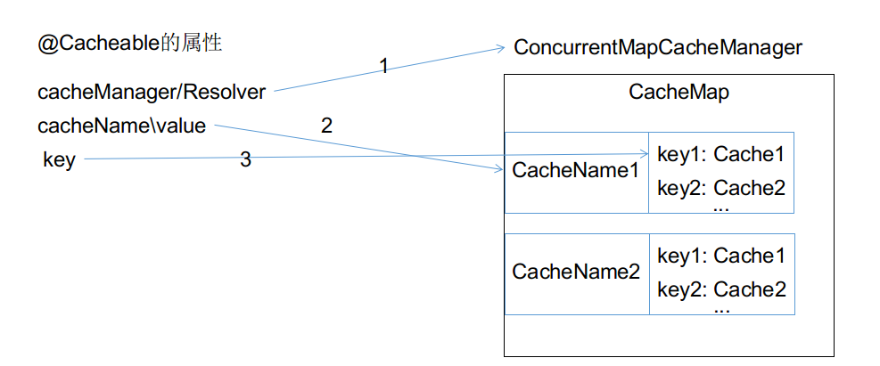

### SpringBoot 缓存

| 名词           | 描述                                                         |
| -------------- | ------------------------------------------------------------ |
| CaheManager    | 缓存管理器（类比连接池），管理Cache，可以自动注入，然后手动操作缓存 |
| Cache          | 具体缓存的实现（类比连接）：redisCache、EhCache、ConcurrentMapCache |
| @EnableCaching | 开启基于注解的缓存                                           |
| @Cacheable     | 缓存方法的返回值，先检查有无缓存，无缓存再执行方法           |
| @CachePut      | 既执行方法有更新缓存 用于修改数据的方法上，每次先执行方法，将结果存入缓存 |
| @CacheEvict    | 清除缓存  用于删除数据的方法                                 |
| keyGenerator   | 缓存的key生成策略                                            |
| serialize      | 缓存数据value的序列化策略                                    |
| @Caching       | @Cacheable + @CachePus + @CacheEvict  定义复杂缓存规则       |
| @CacheConfig   | 用在类上，指定该类中cache配置的公共部分 cacheNames\Manager\Resolver\ keyGenerator |

[toc]

### 使用缓存：


* 导入spring-boot-starter-cache
* 默认使用SimpleCacheConfiguration --> ConcurrentMapCacheManager

1. 在启动类上开启基于注解的缓存  @EnableCaching
2. 在方法上使用@Cacheable等注解


@Cacheable参数：

>cacheNames、value : 指定缓存组件名 因为cachemanager要管理多个cache组件
>
>key：缓存的key，默认方法参数名，spel表单式：#id 取参数值== #root.args[0]
>
>> 默认生成策略：keyGenerator --> SimpleKeyGernerator
>>
>> > 如果没有参数：以new SimpleKey()作为key
>> >
>> > 如果有一个参数：将该参数值作为key
>> >
>> > 如果有多个参数：以new SimpleKey(params)作为key
>
>keyGenerator:key的生成策略与key二选一
>
>cacheManager:多个缓存管理器时指定\或指定cacheResolver
>
>condition：符合条件的情况下缓存 spel #id>0
>
>unless:与condition相反 #result拿到方法返回值 unless="#result==null"
>
>sync:是否使用异步模式

### 原理

* CacheAutoConfiguration  中引入了 CacheAutoConfigurationImportSelector，其返回的数组中包含所有类型缓存的自动配置类

  提供的配置类 xxxCacheConfiguration

  GENERIC,JCACHE,EHCACHE,HAZELCAST,INFINISPAN,COUCHBASE,REDIS,CAFFEINE,SIMPLE,NONE;

* 根据各个自动配置类的生效条件，最终将xxCacheConfiguration加入到IOC。(默认SimpleCacheConfiguration)


执行流程：方法执行前先检查缓存中有无缓存，默认使用方法参数值作为key

1. 从指定的cacheManager/Resolver 的cacheMap中获取 该cacheName对应的cache,如果没有就创建，

2. 根据key生成策略生成key

3. 从cache中存取key对应的传出内容，没有查到缓存就调用目标方法

4. 将方法返回值存入缓存，并返回

   

核心：

* 按照cacheManager（默认ConcurrentMapCacheManager）获取cache组件，
* key时keyGenerator生成的，默认使用simpleKeyGenerator



### @Cacheable的参数

* key：指定key的生成方式 ：```key = "#root.method.name+'[' + #id +']' " 生成的key 为 方法名[id的值]```

  <font color="red">@Cacheable的key不能使用 #result   (因为查询缓存会先于方法执行)</font>

* keyGenerator：指定容器中的key生成策略的beanID 与key二选一，```keyGenerator="mykey"```
  
  * 自定义keyGenerator

```java
@Configuration
public class CacheConfig {

    @Bean("mykey")
    public KeyGenerator mykey(){//是cache中的KeyGenerator
        return new KeyGenerator() {
            @Override
            public Object generate(Object target, Method method, Object... params) {
                return method.getName()+"["+ Arrays.asList(objects).toString()+"]";
                //方法名[[参数列表]]
            }
        };
    }
}
```


* condition：满足条件才缓存  

  ```condition="#id>1 and #root.method.name eq 'getUser'" 参数id的值大于1并且方法名是getUser时才缓存```

* unless：满足条件不缓存

  ```unless="#id >3" 参数id的值大于3就不缓存```

* sync：是否异步缓存，默认false，异步模式下不支持unless


### @CachePut：先执行方法，然后将结果缓存，注意参数

例如更新员工信息

```java
//查询员工
@Cachable(cacheName="employee",key="#id")
public Employee getById(Integer id){...}
//更新员工
@CachePut(cacheName="employee",key="#result.id")//或者 #employee.id
public Employee updateEmployee(Employee employee){...return employee}
```


### @CacheEvict：用于删除数据，注意参数对应

* allEntries = false  是否指定缓存组件中的所有缓存，默认关闭
* beforeInvocation = false 是否在方法执行前删除缓存，默认之后执行，如果出现异常就不清空缓存

```java
//删除员工
@CacheEvict(cacheNames="employee",key="#id")
public void deleteById(Integer id){...}
```


### @Caching：参数 cacheable={@Cacheable(),@Cacheable()},put={@CachePust(),..},evict={...}


### 使用Redis缓存

默认的SimpleCacheConfiguraiton 使用ConcurrentMapCache

* 导入spring-boot-starter-data-redis 即可自动启用RedisCacheConfiguraiton
* 在配置文件配置redis

#### RedisTemplate<Object,Objcet> \ StringRedisTemplate


#### 序列化方式修改

在RedisTemplate源码中可以看到默认的序列化器为JDK序列化

* 参照RedisAutoConfiguration中RedisTemplate的生成方式
* 参照RedisTemplate中的各种序列化参数
* 直接为新的redisTemplate设置默认序列化器

```java
@Configuration
public class RedisConfig {
    @Bean("jsonRedisTemplate")//如果不指定name，则原来的RedisTemplate<Object, Object>不再提供
    //注意：自动配置的redisTemplate生效条件：@ConditionalOnMissingBean(name = "redisTemplate")
    public RedisTemplate<String,Object> redisTemplate(RedisConnectionFactory redisConnectionFactory) throws UnknownHostException {
        RedisTemplate<String, Object> template = new RedisTemplate<>();
        template.setConnectionFactory(redisConnectionFactory);
        //序列化器，将所有Object类序列化
        //一定要设置ObjectMapper 否则从缓存拿回的值是 LinkedHashMap无法转回对象
        Jackson2JsonRedisSerializer jacksonSerializer = new Jackson2JsonRedisSerializer(Object.class);
        ObjectMapper mapper = new ObjectMapper();
        mapper.setVisibility(PropertyAccessor.ALL, JsonAutoDetect.Visibility.ANY);
        mapper.enableDefaultTyping(ObjectMapper.DefaultTyping.NON_FINAL);
        jacksonSerializer.setObjectMapper(mapper);
        //修改默认的序列化方式，redisTemplate默认序列化器默认开启，再设置key，value等的序列化方式前会检查是否有开启了默认序列化器
        template.setDefaultSerializer(jacksonSerializer);
        return template;
    }
}
```


#### 使用方式

##### (缓存序列化仍然默认JDK，需要参照org.springframework.boot.autoconfigure.cache.RedisCacheConfiguration)

* 使用缓存注解
* 默认缓存的k-v都是Object，使用JDK序列化保存
* springBoot2.x环境下，修改rediscache序列化方式需要自己向容器注入RedisCacheManager 容器中有了CacheManager之后，默认的CacheManager失效

```java
@Primary//将该缓存管理器设为默认，此处已经没有必要，因为自动配置的管理器已经失效
@Bean//为修改缓存序列化方式，参照RedisCacheConfiguration 自定义redisCacheManager
public RedisCacheManager cacheManager(RedisConnectionFactory connectionFactory) {
    //拿到redisCache配置类，修改redis配置类的默认配置
    //一定要设置ObjectMapper 否则从缓存拿回的值是 LinkedHashMap无法转回对象
    Jackson2JsonRedisSerializer jacksonSerializer = new Jackson2JsonRedisSerializer(Object.class);
    ObjectMapper mapper = new ObjectMapper();
    mapper.setVisibility(PropertyAccessor.ALL, JsonAutoDetect.Visibility.ANY);
    mapper.enableDefaultTyping(ObjectMapper.DefaultTyping.NON_FINAL);
    jacksonSerializer.setObjectMapper(mapper);
    //修改默认的序列化方式
    template.setDefaultSerializer(jacksonSerializer);
    RedisCacheConfiguration configuration = RedisCacheConfiguration.defaultCacheConfig()
        .serializeKeysWith(//key序列化方式
        RedisSerializationContext.SerializationPair.
        fromSerializer(
            new Jackson2JsonRedisSerializer<String>(String.class)))
        .serializeValuesWith(//value序列化方式
        RedisSerializationContext.SerializationPair
        .fromSerializer(jacksonSerializer))
        .entryTtl(this.timeToLive);//存活时间
    //构造RedisCacheManager
    RedisCacheManager redisCacheManager = RedisCacheManager.builder(connectionFactory)
        .cacheDefaults(configuration)
        .build();
    return redisCacheManager;
}
```


* 默认给key加了前缀：cacheNames::key

##### 注意：定义了缓存值将所有 Object序列化，取缓存的时候也只能取Object。否则会报转换错误

##### 从缓存取出的类型为 LinkedHashMap 导致类型转换错误，需要配置ObjectMapper

```java
Jackson2JsonRedisSerializer jacksonSerializer = new Jackson2JsonRedisSerializer(Object.class);
        ObjectMapper mapper = new ObjectMapper();
        mapper.setVisibility(PropertyAccessor.ALL, JsonAutoDetect.Visibility.ANY);
        mapper.enableDefaultTyping(ObjectMapper.DefaultTyping.NON_FINAL);
        jacksonSerializer.setObjectMapper(mapper);
```


### 编码方式手动操作缓存

```java
@Autowired
private CacheManager cacheManager;
public ....{
    Cache emp = cacheManager.getCache("employee");//拿到缓存
    emp.put("emp::2",....);
}
```

