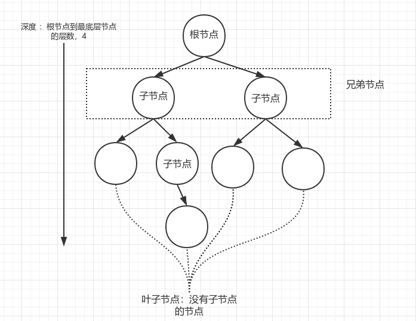
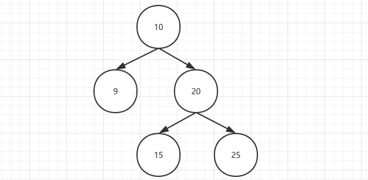

 # 二叉树

 树是一种非线性结构，相对于线性结构（链表、数组）而言，树的平均运行时间更短



* 一棵树至少由1个节点（根节点）

* 树由节点组成：

  一个节点包括 一个数据 和指向其子节点的指针

  多个节点联系起来就构成了树

  

  

### 二叉树：一个节点最多有两个子节点

* 构造二叉树
  1. 构造节点
  2. 连接节点



* 二叉树遍历方式

  如果节点有子节点，则优先处理子节点

  * 先序遍历：

    根节点 -> 左节点 -> 右节点

    10 - 9 - 20 - 15 - 25

  * 中序遍历

    左节点 -> 根节点 -> 右节点

    9 - 10 - 15 - 20 - 25

  * 后序遍历

    左节点 -> 右节点 -> 根节点

    9 - 15 - 25 - 20 - 10

* 通过 先序+中序  或者 中序+后序 即可确定二叉树

```java
public class Tree {
    Node root;
    @Data
    static class Node {
        Integer item;
        Node left;
        Node right;
        public Node(Integer item, Node left, Node right) {
            this.item = item;
            this.left = left;
            this.right = right;
        }
    }
    //先序遍历
    public static void iter(Node root){
        if ( null != root){
            System.out.println(root.item);
            iter(root.left);
            iter(root.right);
        }
    }
```


### 二叉查找树（binary search tree）

根节点左边全都小于根节点，右边全都大于根节点

例如：传入数组 {5,3,7,0}，以5作为根节点，其余数与5比较，分布到左右子节点

```java
public void addNode(Integer value){
    //如果当前树没有根节点，则将该数作为根节点
    if (null == this.root){
        this.root = new Node(value,null,null);
    }else {
        //先将现有的根节点用来比较
        Node someRoot = this.root;
        while (null != someRoot){
            //当前值大于根节点值,放到右边
            if (value > someRoot.getItem()){
                //右边还没有节点，直接插入
                if (null == someRoot.getRight()){
                    someRoot.setRight(new Node(value,null,null));
                    break;
                }else {//右边已经有了节点，将右边节点作为根节点，进行迭代比较
                    someRoot = someRoot.getRight();
                }
            }else {//当前值小于根节点值，放入左边
                if (null == someRoot.getLeft()){
                    someRoot.setLeft(new Node(value,null,null));
                    break;
                }else {
                    someRoot = someRoot.getLeft();
                }
            }
        }

    }
}
```


#### 查询树深度

分别统计左右节点的字数深度，返回最大的+1

```java
public int getHeight(Node node){
    if (null == node){
        return 0;
    }else {
        int left = getHeight(node.left);
        int right = getHeight(node.right);

        int max = left;
        if (right > max){
            max = right;
        }
        return max+1;//每次调用该方法深度+1
    }
}
```


#### 查询树的最大值

分别计算左子树和右子树最大值与根节点值比较

```java
public Integer maxNode(Node node){
    if (null == node){
        return -1;
    }else {
        Integer LeftMaxNode = maxNode(node.left);
        Integer rightMaxNode = maxNode(node.right);
        //当前节点值
        Integer currentVal = node.item;
        Integer max = LeftMaxNode;
        if (rightMaxNode > max){
            max = rightMaxNode;
        }
        if (currentVal > max){
            max = currentVal;
        }
        return max;
    }
}
```

