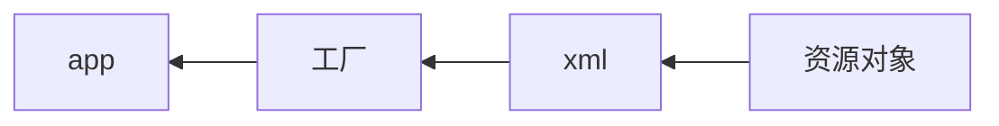

<h1>Spring</h1>


---

<center>Contents</center>

[TOC]

---

### 一、一站式开发

> Struts2（web层）—— Spring（业务层）——Hibernate（持久层）
>
> Spring管理整合Struts2，Hibernate等
>
> 方便解耦，简化开发，事务自动管理

### 二、IOC

> Inverse of Control：控制反转
>
> 对象的创建权交给给Spring，解决程序耦合性高的问题



> 工厂由Spring提供
>
> xml中记录需要有Spring管理的实现类

**IOC的编写过程**

1. 下载spring以及其依赖包，并导入

2. 包结构：接口+实现类

3. 将实现类交给Spring

   新建spring配置文件：```src/applicationContext.xml```

   xml约束：```spring包/docs/…reference…./xsd….configuration…html最后的bean```

   ```xml
   <?xml version="1.0" encoding=UTF-8?>
   <约束..../>
   <beans>
       <bean id="为实现类指定id" class="实现类的完整路径"></bean>
   </beans>
   ```

4. 使用工厂获取对象

   ```java
   //创建工厂
   ApplicationContext ac = new ClassPathXmlApplicationContext("配置文件名");
   //从工厂获取对象
   接口类 对象 = (实现类) ac.getBean("实现类id");
   //使用对象
   对象.xxx();
   ```

   工厂：```ApplicationContext接口```，```BeanFactory接口（过时）```

   ```
   ApplicationContext接口的实现类：
   	ClassPathXmlApplicationContext	读取src目录的配置文件，加载完就创建对象
   	FileSystemXmlApplicaionContext	读取文件系统，使用getBean时创建对象
   ```

### 三、Spring配置文件

```xml
<约束/>
<import resource="引入配置文件"/>
<beans>
    <bean id="实现类id" 	不能使用特殊字符
          name="实现类名"	与id同效，可以使用特殊字符1
          class="实现类路径"
          scope="singleton默认"	作用范围
          		singleton	单例，运行时只能创建一个对象
          		prototype	多例，每次调用都创建新对象，Action使用多例，线程安全
          		request,session,globalsession(全局web应用)
          init-method="初始化时调用的方法名"
          destroy-method=""
    </bean>
</beans>
```

有多个配置文件时，既可以使用import标签，也可以同时加载多个配置文件：

```java
ApplicationContext ac = new ClassPathXmlApplicationContext("1.xml","2.xml")
```


### 四、DI

> 依赖注入：
>
> ​	app类需要dao类的方法；spring负责创建dao对象，并将其注入到app

> Spring自动调用setter方法来为对象注入属性值

1. 注入属性

   ```xml
   <bean id="xxx" class="xxx">
       <property name="成员变量名" value="值"/>
   </bean>
   ```

2. 注入对象

   ```xml
   <property name="成员类对象" ref="类对象的id"/>
   ref 来引用
   ```

3. 注入构造方法(默认使用无参数的构造方法)

   ```xml
   <bean id="xxx" class="xxx">
       <constructor-arg name="构造方法参数1" value="值"/>
       <constructor-arg name="构造方法参数2" ref="对象id"/>
       ...
   </bean>
   ```

4. 注入集合

   * 注入数组或List集合

     ```xml
     <property name="arrs">
         <list>
             <value>值1</value>
             <value>值2</value>
             ....
             或者
             <ref bean="对象id"/>
             ...
         </list>
     </property>
     ```

   * 注入Set集合

     ```xml
     <Set>
         <value>值1</value>
         ...
         或
         <ref bean="对象id"/>
         ...
     </Set>
     ```

   * 注入Map集合

     ```xml
     <map>
         <entry key="键" value="值"/>
         ...
         或
         <entry key-ref="" ref="对象id"/>
     </map>
     ```

   * 注入属性文件（Properties类）

     ```xml
     <props>
         <prop key="键">值</prop>
         ...
     </props>
     ```

     