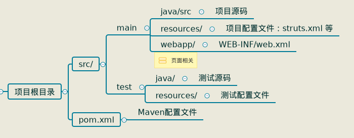

<h1>Maven</h1>
<font size=4>开发管理工具：依赖管理，项目一键构建</font>

POM：项目对象模型；依赖管理模型

---

<center>Contents</center>
[TOC]

---

### 1.Maven关键字

* ##### 依赖管理（jar包管理）

  > maven仓库 ：repository —— jar包仓库 ；
  >
  > 项目中提供jar包的坐标（Apache组织的Struts2开源项目的2.3.24版本）；
  >
  > 有索引存在，找jar包很快

* ##### 项目的一键构建

  > 编译 -> 测试 -> 打包 -> 部署到本地

### 2. 使用Maven的好处

> 同样的项目使用Maven工程来实现项目源码更小

### 3. Maven安装与配置

* 安装

  ```shell
  1. 下载Maven-3.3.9压缩包,并解压
  2. 配置环境变量
  vim	/etc/profile
  	MAVEN_HOME=/usr/local/src/maven/apache-maven-3.3.9
  	export PATH=$PATH:$MAVEN_HOME/bin
  vim ~.bashrc
  	export PATH=....:/usr/local/....
  3. 验证安装：mvn -v
  ```

* 配置仓库

  ##### 仓库类型：本地仓库，私服（局域网内仓库），中央仓库（公用）

  ```
  本独仓库不全 -> 有私服？去私服下载：直接去中央下载
  私服不全 -> 去中央下载
  ```

  * ##### 本地仓库配置

    ```xml
    $MAVEM_HOME/cong/settings.xml
    <settings>
        <localRepository>
            本地仓库路径
        </localRepository>
    </settings>
    ```

---

### 4. Maven命令（cd 项目根目录）

* Maven生命周期

  > cleanLifeCycle：清理已经生成的target目录
  >
  > defaultLifeCycle：编译->测试->打包jar/war->部署
  >
  > siteLifeCycle：生成项目报告，站点，发布站点

* 命令

  ```shell
  mvn clean：清理target目录
  mvn compile：编译项目
  mvn test：运行项目中的测试类
  mvn package：打成jar/war包
  mvn install：将本项目放入本地仓库
  ```

---

### 5. Maven项目结构



---

### 6. 创建Maven项目

* idea 配置Maven

  - Idea 2018存在bug，需要如下配置

    ```
    file - settings - build,execution... - build tools - maven - importing
     - 取消 store generated pro files externally
    ```

  - 新建webapp

    ```xml
    file - new - project - Maven
     - 勾选 create from archetype
     - 选择 org.apache.maven.archetypes:maven-archetype-webapp
    groupId:公司/组织名，com/org.
    arifcatId:项目名
    packaging:jar/war/pom(工程聚合时的父项目)
    <groupId></groupId>
  <artifactId></arifactId>
    <version></version>
  <packaging></packaging>
    ```
    
    手动创建源代码目录
    
  ```
    右键main目录 - 新建java目录 - 右键java目录 - make directory as - 
   - source root
  ```
  
    创建servlet

    ```
    右键java目录 - new - servlet
    ```
  
    ```xml
    导入servlet依赖包
    pom.xml
    <dependencies>
        <dependency>
           <groupId>javax.servlet</groupId>
            <artifactId>javax.servlet.api</artifactId>
            <version>3.1.0</version>
            <scope>provided</scope>
        </dependency>
    </dependencies>
    ```

* ##### <font color="red">依赖范围 scope</font>

  ##### Maven仓库依赖包的作用范围

  | scope值  | 范围               | example            |
  | -------- | ------------------ | ------------------ |
  | compile  | 测试编译运行时有效 | spring-core.jar    |
  | test     | 测试时有效         | Junit.jar          |
  | provided | 编译测试时有效     | servlet-api.jar    |
  | runtime  | 测试运行时有效     | jdbc驱动           |
  | system   | 编译测试时有效     | 本地仓库以外的类库 |


* 在pom.xml添加依赖（Maven自动导入与其依赖的包）

  alter+insert

----

### 7.  在idea启动Maven

* 为工程配置tomcat

  ```java
  点击 pom.xml ,点击以前配置tomcat的位置，编辑配置；
  ！！！servlet-api必须配置作用范围为provided
  添加 Maven，填写Name，
  command line位置填写 [clean] tomcat:run
  点击运行
  ```

---

### 8. Maven工程的拆分与聚合

* 拆分：进一步降低耦合

  ```子模块pom.xml使用<parent>指定父工程，<dependency>引入其他子模块```

  dao，service，web表现为独立的工程

* 聚合：拆分的工程组合到一起，形成一个完整的项目

  ```父工程pom.xml使用 <modules>引入子模块```

* ##### 父工程表现为```Maven project```；子模块表现为```Maven module```

* ##### 构建 父工程 与 子模块

  > 1. idea创建 Maven project 不选择骨架
  >
  >    目录结构：```pom.xml```—— 配置子模块通用的jar；
  >
  >    ```src/ ```——可以删除
  >
  >    ```父工程不写代码```
  >
  >    
  >
  > 2. 右键Maven project 新建  Maven module，选择骨架，留心其父工程及工程目录

* dao 模块 pom.xml

  ```xml
  父工程的pom.xml，自动生成
  <modules>
      <module>子模块</module>
  </modules>
  子模块的pom.xml，自动生成
  <parent>
      <groupId>父工程的groupId</groupId>
      <artifactId>父工程名</artifactId>
      <version>父工程版本号</version>
  </parent>
  ```

* 更多子模块

  每个模块都有打包方式，本身也可以作为依赖包被引入

  ```xml
  service模块 pom.xml 添加依赖包 dao
  <denpendency>
      <groupId>dao模块公司/组织名</groupId>
      <artifactId>dao模块名</artifactId>
      <version>dao模块版本</version>
  </denpendency>
  
  web模块 pom.xml添加 service包
  ```

  

---

### 9. 依赖关系

* Maven中导入核心包，自动导入与其相关的依赖包

* 子模块可以继承其父工程中添加的依赖包

* 依赖传递（继承、传递）与<scope>有关，不是无限的

  父工程中，使用compile范围可以传递到任何范围

* 依赖调节的原则（多个包版本冲突）

  * 第一声明者优先：使用最先声明的包版本

  * 路径近者优先：优先使用自己手动声明的包版本

  * 排除冲突：使用<excludes>标签，指定哪个包版本不使用

  * 父工程锁定包版本

    ```xml
    <dependency>
        <dependencies>
            <groupId>。。。</groupId>
            <artifactId>。。。</artifactId>
            <version>要锁定的版本</version>
        </dependencies>
    </dependency>
    ```

---

### 10. 私服


---

### Attentions

* idea包含多个模块时，留意浏览器的url地址

